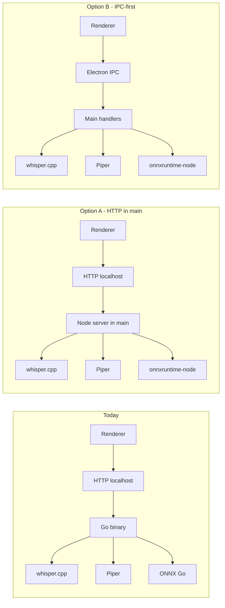

# Migration plan: Go local AI backend → TypeScript / Electron

**Status:** backlog (not scheduled).  
**Purpose:** Replace the spawned Go HTTP service (`alice-upstream/backend/`, default `http://127.0.0.1:8765`) with equivalent behavior implemented in the Electron stack (main process and/or small Node-side server), so local STT (whisper.cpp), TTS (Piper), and embeddings (MiniLM + ONNX) no longer require a separate Go binary or `npm run build:go`.

## Terminology

- **TS** means **TypeScript** — the typed language used for the Vue renderer, Electron main/preload, and shared app logic. This migration is “Go backend → **TypeScript (Node/Electron)** implementation,” not a second language runtime.

## Why consider this

- **Single toolchain:** TypeScript + Node for app and local inference orchestration; fewer CI targets.
- **Dev ergonomics:** No Go rebuild loop for backend changes (see `.cursor/rules/dev-mode-hotreload.mdc`).
- **Privacy / surface area:** Option to drop localhost HTTP in favor of IPC-only bridges (aligns with fork hardening goals in `.cursor/rules/alice-fork-upstream.mdc`).

Performance is not a primary driver: Whisper and Piper remain native subprocesses; embeddings use **`onnxruntime-node`** (native addon), analogous to today’s Go + `onnxruntime_go`.

## Current state (reference)

| Capability | Implementation today |
|------------|----------------------|
| STT | Go orchestrates **whisper.cpp** binary (`alice-upstream/backend/internal/whisper/`) |
| TTS | Go orchestrates **Piper** binary (`alice-upstream/backend/internal/piper/`) |
| Embeddings | Go + **`onnxruntime_go`** + tokenizer (`alice-upstream/backend/internal/minilm/`) |
| API | HTTP server; renderer uses `alice-upstream/src/services/backendApi.ts` |
| Lifecycle | `alice-upstream/electron/main/backendManager.ts` spawns Go executable |

## Target architecture (partially decided)

**Embeddings (decided):** use the **`onnxruntime-node`** native addon (not WASM in the renderer) for parity with current latency and behavior.

**Renderer ↔ main transport (undecided):** choose later between **loopback HTTP served from Electron main** vs **IPC-only**. Tradeoffs:

| | **HTTP in main (localhost)** | **IPC-only** |
|---|------------------------------|--------------|
| **Migration cost** | Lower: keep `backendApi.ts` axios shapes and URLs; swap process behind the port. | Higher: replace client with preload/`invoke` API and thread types through callers. |
| **Attack / exposure surface** | Listener on loopback; must ensure bind address and port rules stay strict. | No extra socket; channel is Electron IPC (still needs careful validation of payloads). |
| **Debugging** | Familiar `curl`/logging of HTTP; mirrors current Go service. | DevTools sees fewer “network” calls; rely on main-process logs and IPC tracing. |
| **Large payloads** | HTTP body for audio/base64 is well-trodden; watch memory on huge buffers. | Structured clone over IPC has size/perf limits; may need streaming or temp files for big audio. |
| **Testing** | Could hit local server from tests outside Electron (with care). | Tests more tied to Electron or mocked IPC. |
| **Fork goals** | Fine if documented as localhost-only and hardened. | Aligns with “narrow bridges” if you want zero HTTP for local AI. |

## Staged milestones (decided)

Work proceeds in **stages** so context and risk stay bounded; **do not** attempt full STT+TTS+embeddings in a single large change.

Suggested order (adjust if product priorities differ):

1. **Stage 1 — Embeddings**  
   Port MiniLM + ONNX to **`onnxruntime-node`** behind the same logical API the app uses today; feature-flag or side-by-side with Go for that slice only if needed.

2. **Stage 2 — TTS (Piper)**  
   Subprocess orchestration + asset paths + `backendApi` TTS paths; Go still handles STT until Stage 3.

3. **Stage 3 — STT (whisper.cpp)**  
   Subprocess orchestration + model/binary lifecycle; then remove Go from default startup.

Each stage should **build and package** for **Windows, macOS, and Linux** (see platforms below).

## Platforms (decided)

- **Ship parity on all three platforms** (Windows, macOS, Linux).
- **Primary manual testing on Windows** is acceptable; CI or cross-builds should still assert other targets where the project already does for Go/native artifacts.
- **Rationale:** Removing the Go backend **reduces** platform-specific **toolchain** work (no per-OS Go cross-compile for that binary). Native addons (`onnxruntime-node`, existing sqlite/hnsw) still require per-platform binaries — that set is already part of the Electron/native story; the migration should not add a *second* language runtime’s build matrix for the local AI service.

## Phases (how to execute)

### Phase 0 — Spike (per stage)

- Validate packaging paths for that stage’s binaries/models on all platforms (electron-builder, `resources/`).
- Prove one end-to-end call from renderer through the chosen transport (HTTP or IPC — may follow stage 1 default and revisit).

### Phase 1–3 — Implement by stage

- TypeScript modules under `electron/main/` (e.g. `electron/main/local-ai/`) mirroring responsibilities of the Go packages.
- Feature flag or env (e.g. `USE_TS_LOCAL_BACKEND` / per-capability flags) until the stage is stable.

### Phase 4 — Cutover

- Default to TS implementation for completed stages; stop spawning Go when parity is reached.
- Update CI: gate or remove default `build:go` for the app path; keep optional job if upstream comparison matters.

### Phase 5 — Cleanup

- Remove or archive Go backend from product builds; document intentional fork divergence for upstream merges.

## Remaining open questions

1. **HTTP vs IPC** — undecided; use the tradeoff table above when picking (can choose HTTP for early stages and move to IPC later, or commit to IPC once embeddings are stable).
2. **Upstream mergeability** — still open: stay flag-compatible with `pmbstyle/alice` vs fork-only replacement acceptable?

---

## Decisions log

| Date | Decision | Notes |
|------|----------|--------|
| — | **Embeddings:** `onnxruntime-node` (native addon) | User confirmation. |
| — | **Rollout:** staged (embeddings → TTS → STT) | Avoid single huge change. |
| — | **Platforms:** win + mac + linux; test focus Windows | Fewer toolchain deps overall vs Go backend. |
| — | **HTTP vs IPC:** deferred | Enumerate tradeoffs before choosing. |

*Update the table when HTTP/IPC and upstream strategy are decided.*
